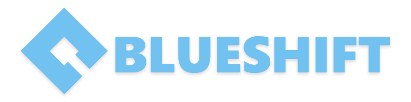

  <h1>Zombie Game</h1>
  <ul style="list-style-type:none; margin:0; padding:0;">
    
	
    
  </ul>

---

An unnamed zombie game for Roblox Fall Accelerator 2020.

## Table of Contents

- [Team](#-team)
- [Resources](#-resources)

## Team

**Team Leader** - [*Legoracer*](https://www.roblox.com/users/101545/profile)

**Main Programmer** - [*metaprogramming*](https://www.roblox.com/users/22188677/profile)

**Graphic Designer** - [*CaptainRojon*](https://www.roblox.com/users/21937115/profile)

**Model Designer** - [*Xivaksa*](https://www.roblox.com/users/133805584/profile)

**Sound Designer** - [*a8y*](https://www.roblox.com/users/46292035/profile)

## Resources

[Developer Hub](https://developer.roblox.com/api-reference) - Roblox devhub API.

[Roblox API](https://robloxapi.github.io/ref/) - Roblox github API.

[AeroGameFramework](https://sleitnick.github.io/AeroGameFramework/) - AGF documentation.

[Rojo](https://rojo.space/docs/) - Rojo documentation.

[Codestream](https://docs.codestream.com/userguide/) - A user guide going over features.
